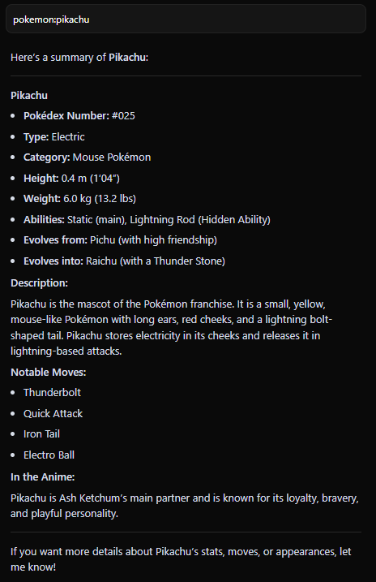
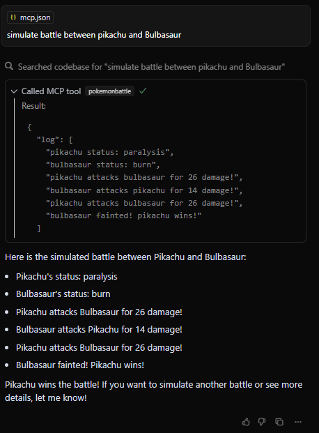

# Pokémon MCP Server

---

<p align="center">
  
</p>

---

## Project Overview

Welcome to the **Pokémon MCP Server**! This project lets you:

- 🗂️ **Fetch Pokémon Data:** Get detailed info (stats, types, abilities, moves, evolution chain) from the public PokéAPI.
- ⚔️ **Simulate Battles:** Run simple Pokémon battles with type effectiveness and status effects.

The server exposes these features via the Model Context Protocol (MCP), and a client can call the resource and the tool.

---

## Setup & Installation

### Prerequisites

- Python **3.8+**
- Internet connection (for PokéAPI)
- `requests` and `fastmcp` libraries

### Install Dependencies

```bash
pip install -r requirements.txt
```

---

## Running the Server

1. **Open a terminal** and navigate to the project directory.
2. **Start the server** (TCP transport):

```bash
python pokemon_mcp.py
```

> 🟢 **This will start the MCP server on `localhost:12345`.**

---

##  Running the Client

1. **Open another terminal** in the same directory.
2. **Run the client script:**

```bash
python pokemon_client.py
```
---

## Features

### Get Pokémon Info
- Request Pokémon details using:
  - `pokemon://info/{pokemon_name}`
- **Example:**
  ```python
  result = client.call("pokemon://info/pikachu")
  print(result)
  ```

### Simulate Battle
- Simulate a battle between two Pokémon:
  - `pokemon://battle?pokemon1={name1}&pokemon2={name2}`
- **Example:**
  ```python
  battle_result = client.call("pokemon://battle", pokemon1="pikachu", pokemon2="bulbasaur")
  print(battle_result)
  ```

---

## Example Usage

<p align="center">
  
  
</p>

```python
from mcp.client.fastmcp import FastMCP

client = FastMCP("pokemon", transport="tcp", host="127.0.0.1", port=12345)

# Get info about Pikachu
result = client.call("pokemon://info/pikachu")
print(result)

# Simulate battle between Pikachu and Bulbasaur
battle_result = client.call("pokemon://battle", pokemon1="pikachu", pokemon2="bulbasaur")
print(battle_result)
```

---

## 🛟 Troubleshooting

- ✅ **Ensure the server is running before the client.**
- ✅ **Confirm both use the same host and port.**
-  **If you get connection errors:**
  - Check firewall or network settings
  - Check Python version and installed packages

---

## 📁 Project Files

| File               | Description                        |
|--------------------|------------------------------------|
| `pokemon.py`   | MCP server implementation          |
| `pokemon_client.py`| Example client script               |
| `requirements.txt` | Python dependencies list           |
| `README.md`        | This documentation file            |

---
